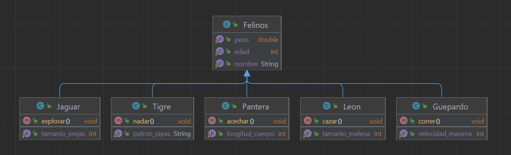
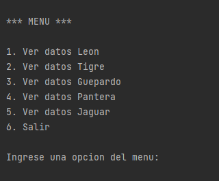
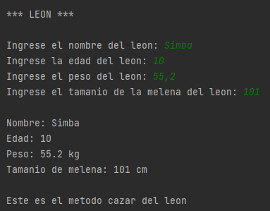
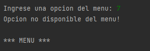
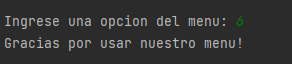

El programa consiste en la creacion de la clase padre llamada felinos y clases hijas llamadas: leon, tigre, guepardo, 
pantera, jaguar. El usuario podra ingresar al menu y elegir entre las 5 especies de felinos que existen y asignarles
el nombre, edad, peso y una variable extra de cada especie y se imprimiran todos los datos ingresados de la especie
ingresada

